# Integration Guide

## Introduction

SketchPro is a hosted web application. Everything is handled for you, all you need to do is:

1. Launch SketchPro
1. Load your data
1. Listen for updates

## SDS

SketchPro uses the open [Sketch Data Schema](sds/guide.md) (SDS) specification to communicate sketch data.

## Technology

SketchPro uses the web standard Broadcast Channel API to communicate with your application. To learn more about this mechanism please refer to the following resources:

- [BroacastChannel](https://developer.mozilla.org/en-US/docs/Web/API/BroadcastChannel)
- [Window.postMessage()](https://developer.mozilla.org/en-US/docs/Web/API/Window/postMessage)
- [Window: message event](https://developer.mozilla.org/en-US/docs/Web/API/Window/message_event)

## Application Flow

Following is a typical application lifecycle flow. Details of steps are outlined below.

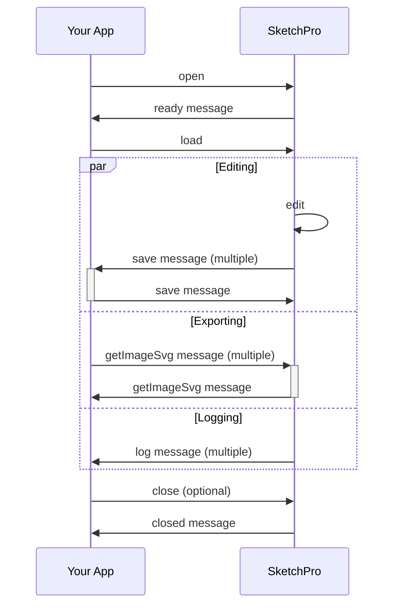

## Launch

On launch SketchPro will check for a valid license. If one is not found the user will be redirected to the licensing page, and then redirected back once authentication is completed.

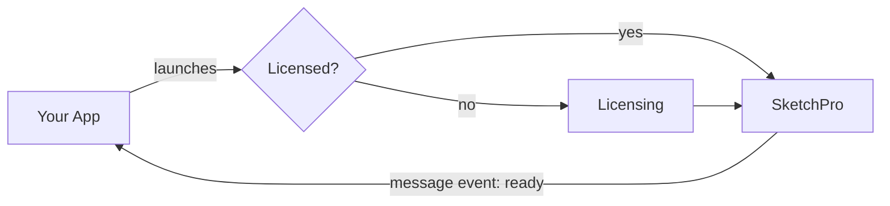

### Ready Response Payload

```ts
{
  type: "ready";
}
```

## Load

Once the application is opened a "ready" message will be sent. Once received the app should load the sketch document by sending a load command with a valid SDS document.

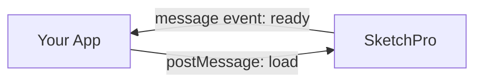

When a ready message is received, this is your opportunity to load data.

### Ready Response Payload

```ts
{
  type: "ready";
}
```

### Load Payload

```ts
{
  type: "load";
  data: {
    data: <sketch data>;
    config: <config data>;
  };
}
```

## Save

When a request to save occurs in SketchPro a save event will be sent. Your app should respond with a "save" message to confirm completion. Multiple save events can occur as the user is given the choice to close or continue upon save.

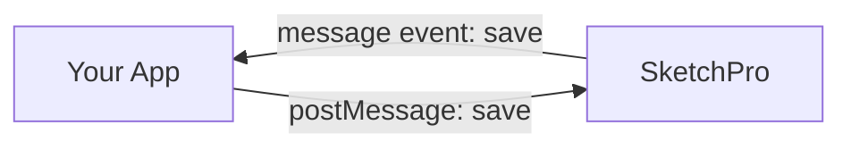

### Save Payload

```ts
{
  type: "save";
  data: {
    data: <sketch data>;
  };
}
```

### Save Success Confirmation Payload

```ts
{
  type: "save";
}
```

### Save Failure Confirmation Payload

```ts
{
  type: "save";
  data: string;
}
```

## Export PNG

Your app can request an SVG export with a "getImagePng" message. SketchPro will send back a "getImagePng" message. Multiple exports can occur while SketchPro is open and ready.

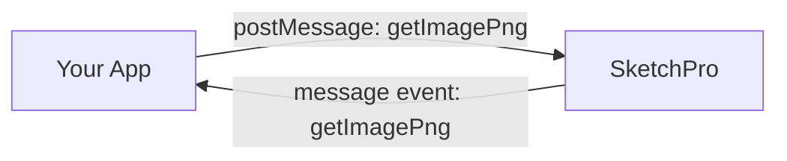

### Export PNG Payload

```ts
{
  type: "getImagePng";
  data: {
    data: <sketch data>;
    config: <config data>;
  };
}
```

### Export PNG Success Payload

```ts
{
  type: "getImagePng";
  data: {
    sketches: {
      id: number;
      page: number;
      name: string;
      data: string; // PNG data URL
    }[];
  };
}
```

### Export PNG Failure Payload

```ts
{
  type: "getImagePng";
  data: {
    error: string;
  };
}
```

## Export SVG

Your app can request an SVG export with a "getImageSvg" message. SketchPro will send back a "getImageSvg" message. Multiple exports can occur while SketchPro is open and ready.

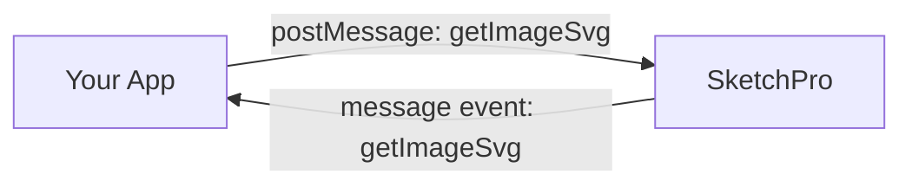

### Export SVG Payload

```ts
{
  type: "getImageSvg";
  data: {
    data: <sketch data>;
    config: <config data>;
  };
}
```

### Export SVG Success Payload

```ts
{
  type: "getImageSvg";
  data: {
    sketches: {
      id: number;
      page: number;
      name: string;
      data: string; // base64 encoded SVG
    }[];
  };
}
```

### Export SVG Failure Payload

```ts
{
  type: "getImageSvg";
  data: {
    error: string;
  };
}
```

## Sketch Select

SketchPro will send a "sketchSelect" message when the selected sketch is changed.

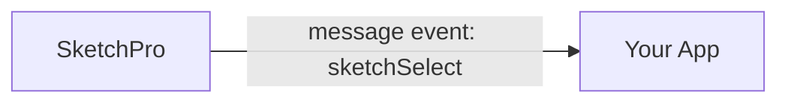

### Sketch Select Payload

```ts
{
  type: "sketchSelect";
  data: {
    sketchId: number;
  };
}
```

## Page Select

SketchPro will send a "pageSelect" message when the selected page is changed.

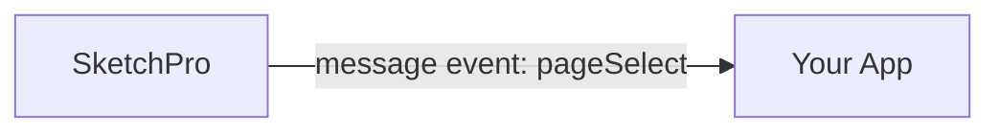

### Page Select Payload

```ts
{
  type: "pageSelect";
  data: {
    sketchId: number;
    pageId: number;
  };
}
```

## Sketch Create

SketchPro will send a "sketchCreate" message when a sketch is created.

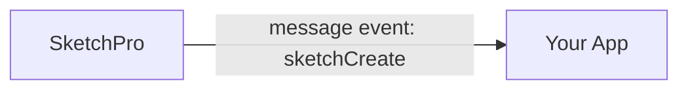

### Sketch Create Payload

```ts
{
  type: "sketchCreate";
  data: {
    sketchId: number;
    label: string;
  };
}
```

## Sketch Delete

SketchPro will send a "sketchDelete" message when a sketch is deleted.


### Sketch Delete Payload

```ts
{
  type: "sketchDelete";
  data: {
    sketchId: number;
  };
}
```

## Polygon Create

SketchPro will send a "polygonCreate" message when a polygon is created.


### Polygon Create Payload

```ts
{
  type: "polygonCreate";
  data: {
    sketchId: number;
    vectorId: number;
    area: number;
    perimeter: number;
    lookupCode: string;
  };
}
```

## Polygon Select

SketchPro will send a "polygonSelect" message when the selected polygon is changed.

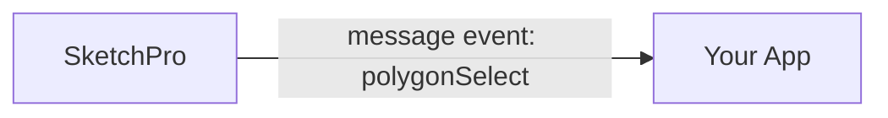

### Polygon Select Payload

```ts
{
  type: "polygonSelect";
  data: {
    sketchId: number;
    vectorId: number;
    area: number;
    perimeter: number;
    lookupCode: string;
  };
}
```

## Select Polygon

Your app can request a polygon to be selected with the "selectPolygon" message. SketchPro will send back a "selectPolygon" message to indicate success or failure.

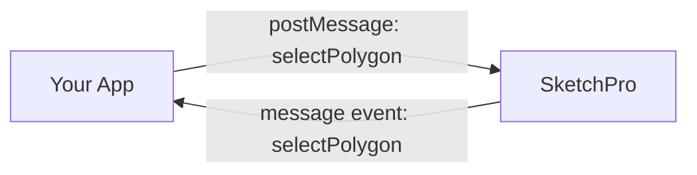

### Select Polygon Payload

```ts
{
  type: "selectPolygon";
  data: {
    sketchId: number;
    pageId?: number;
    vectorId: number;
  };
}
```

### Select Polygon Failure Payload

```ts
{
  type: "selectPolygon";
  data: {
    error: string;
  };
}
```

## Delete Polygon (Introduced v2.1.0)

Your app can request a polygon be deleted with the "deletePolygon" message. SketchPro will send back a "deletePolygon" message in the event of failure.

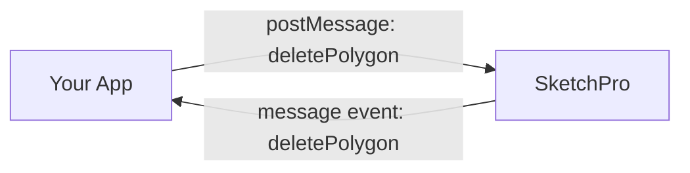


### Delete Polygon Payload

```ts
{
  type: "deletePolygon";
  data: {
    sketchId: number;
    pageId?: number;
    vectorId: number;
  };
}
```

### Delete Polygon Failure Payload

```ts
{
  type: "deletePolygon";
  data: {
    error: string;
  };
}
```

## Log

SketchPro will log messages when appropriate. These messages are all for informational purposes.

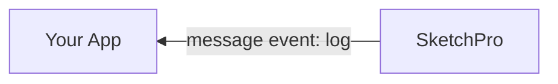

### Log Payload

```ts
{
  severity: "info" | "warn" | "error" | "critical";
  code: string;
  description: string;
}
```

## Close

If SketchPro is closed a closed message will be sent. If your app initiates the close, SketchPro will send the closed event when it has completed.

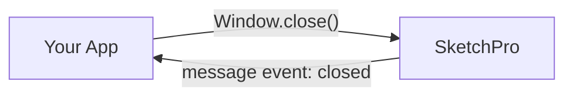

### Closed Payload

```ts
{
  type: "closed";
}
```

## Example Integrations

### Web Browser

SketchPro integrates easily via JavaScript in a browser-based app. Guidance and a working example can be found [here](../examples/browser).

### Windows

SketchPro can integrate with your Windows app through a control such as [WebView2](https://docs.microsoft.com/en-us/microsoft-edge/webview2/). Guidance and a working example for a WPF app can be found [here](../examples/dotnet-webview2).

## Sketch

SketchPro requires an [SDS](sds/guide.md) document object to open. A minimal document includes the schema and sketches. In addition to that, SketchPro requires at least one sketch for a user to get started:

```javascript
{
  $schema: "https://schemas.opencamadata.org/2.0/data.schema.json",
  sketches: [
    {
      label: "Building #1"
    }
  ]
}
```

## Configuration

SketchPro requires a configuration object to open. The configuration object should specify the config version and a non-empty lookup collection that can be used to create segments.  SketchPro and config versions are independent.  A minimal configuration object:

```javascript
{
  version: "1.0",
  lookupCllection: {
    standard: {
      unspecified: {
        "*": {
          name: "ALL TYPES",
          description: "ALL TYPES",
          ordinal: 1,
          styles: {
            vector: {
              color: "#F52817",
              fill: "#D6FCAB",
              stroke: "#1B0C9C"
            }
          }
        }
      }
    }
  }
}
```

### Interface

A variety of options may be specified by a configuration object that you provide when opening SketchPro.

```typescript
interface Configuration {
  /** Config version in x.y semantic version format. */
  version: string;
  sketchSettings?: {
    /** Coordinate precision.  Value must be a positive integer or 0. */
    coordinatePrecision?: number;
    /** Unit of measure.  Default is "feet". */
    unitOfMeasure?: "feet" | "meters";
  };
  capabilities?: {
    paging?: {
      /** Controls whether sketches can have multiple pages. */
      flag: "enabled" | "disabled";
      /** Maximum number of pages.  Minimum is 1.  Default is 1. */
      maximumPageCount: number;
    };
    outbuildings?: {
      /** Controls support of an "outbuildings" domain. */
      flag: "enabled" | "disabled";
      /** Domain outbuildings are associated with.  Default is "outbuilding". */
      associatedDomain?: "unspecified" | "outbuilding";
    };
    arcDrawing?: {
      /** Controls the type of arc drawing. */
      flag: "enabled" | "disabled";
      /** Supported arc types.  Default is "ANY". */
      supportedArcTypes?: "ELL" | "ANY";
    };
    boundaryConstraints?: {
      flag: "enabled" | "disabled";
      /** Size of each side the sketch boundary.  Boundary is square.  Minimum is 1.  Default is 100. */
      defaultBoundarySize?: number;
    };
    colorCustomization?: {
      /** Controls whether segments are drawn using styles defined by an associated lookup. */
      flag: "enabled" | "disabled";
    };
    sketchOriginPosition?: {
      flag: "enabled" | "disabled";
      /** Sketches exist on a cartesian plane with a (0, 0) origin. The plane has [quadrants name according to conventions](https://en.wikipedia.org/wiki/Cartesian_coordinate_system#Quadrants_and_octants). The default is quadrant I or the space of (+, +) coordinates or "bottomLeft". The "bottomLeft" reflects what the user of a sketching app would interpret as the origin is in the bottom-left of the sketch. This capability can be used to change the default quadrant to `topRight` (quadrant III) or `topLeft` (quadrant IV). */
      origin?: "bottomLeft" | "topLeft" | "topRight";
    };
    multipleLabels?: {
      /** Controls whether multiple labels can be associated with segments and vectors. */
      flag: "enabled" | "disabled";
      /** Delimeter used to combine the multiple values into a single text.  Default is "/". */
      delimeter?: string;
    };
  };
  lookupCollection?: {
    /** Recognized values are "standard" and "outbuilding" */
    [lookupName: string]: {
      /** The domain-specific lookups */
      [domain: "unspecified" | "outbuilding"]: {
        [lookupCode: string]: {
          name: string;
          description?: string;
          /** Sort order */
          ordinal?: number;
          /** Styles to apply to associated components */
          styles?: {
            label?: Style;
            dimensionLabel?: Style;
            vector?: Style;
          };
          attributes?: {
            key: string;
            value:
              | string
              | number
              | boolean
              | { [key: string]: unknown }
              | unknown[];
          }[];
        };
      }
    }
  };
  /**
   * Fill options.  Valid values must be a hexadecimal color code or "none".
   * @example
   * [
   *   { name: "None", value: "none" },
   *   { name: "Red", value: "#ff0000" },
   *   { name: "Blue", value: "#0000ff" },
   *   { name: "Green", value: "#0f0" }
   * ]
   */
  fills?: { name: string; value: string }[];
  /**
   * Stroke options.  Valid values must be a hexadecimal color code or "none".
   * @example
   * [
   *   { name: "None", value: "none" },
   *   { name: "Red", value: "#ff0000" },
   *   { name: "Blue", value: "#0000ff" },
   *   { name: "Green", value: "#0f0" }
   * ]
   */
  strokes?: { name: string; value: string }[];
  /**
   * Stroke width options.  Valid values must be a positive integer or 0.
   * @example
   * [
   *   { name: "None", value: 0 },
   *   { name: "Thin", value: 1 },
   *   { name: "Thick", value: 2 }
   * ]
   */
  strokeWidths?: { name: string; value: number }[];
  /**
   * Stroke dash array options.  Values must be an array of positive integer or 0 that represents a pattern of dashses and gaps.  Follows the dash array convension shared in common with SVG/HTML/CSS.
   * @example
   * [
   *   { name: "None", value: [] },
   *   { name: "Dash", value: [4, 4] },
   *   { name: "Dot Dot Dash", value: [2, 2, 2, 2, 4, 2] }
   * ]
   */
  strokeDashArrays?: { name: string; value: number[] }[];
  /**
   * Fill pattern options.  Values must be a pattern object.
   * @example
   * [
   *   { name: "None", value: "none" },
   *   {
   *     name: "Diagonal",
   *     value: {
   *       height: 10,
   *       width: 10,
   *       elements: [
   *         {
   *           path: "M-1,1 l2,-2 M0,10 l10,-10 M9,11 l2,-2",
   *           style: { stroke: "#000", strokeWidth: 2 }
   *         }
   *       ]
   *     }
   *   }
   * ]
   */
  fillPatterns?: { name: string; value: ("none" | Pattern)[] }[];
}
```

Style is an [SDS](sds/guide.md) _style_.

```typescript
interface Style {
  /** Foreground color. Value is a hexadecimal color code or "none" */
  color?: string;
  /** Stroke color. Value is a hexadecimal color code or "none" */
  stroke?: string;
  /** Stroke width. Value is a positive integer or 0 */
  strokeWidth?: number;
  /**
   * An array of positive integer or 0 that represents a pattern of dashses and gaps.
   * Follows the dash array convension shared in common with SVG/HTML/CSS.
   */
  strokeDashArray?: number[];
  /** Fill color. Value is a hexadecimal color code or "none" */
  fill?: string;
  fillPattern?: "none" | Pattern;
}
```

Pattern is an [SDS](sds/guide.md) _pattern_.

```typescript
interface Pattern {
  /** Positive integer or 0. */
  height: number;
  /** Positive integer or 0. */
  width: number;
  /** Drawing elements of the pattern */
  elements?: {
    /** Sequence of commands that follow the [SVG standard](https://svgwg.org/svg2-draft/paths.html#PathData) for path data. */
    path: string;
    /** Style to apply to this element */
    style?: Style;
  }[];
}
```

### Examples

```javascript
{
  capabilities: {
    colorCustomization: {
      flag: "enabled"
    }
  },
  lookupCollection: {
    standard: {
      unspecified: {
        "*": {
          name: "ALL TYPES",
          description: "ALL TYPES",
          ordinal: 1
        },
        AC: {
          name: "CANOPY ALUM.",
          description: "CANOPY ALUM.",
          ordinal: 2,
          styles: {
            vector: {
              color: "#F52817",
              fill: "#D6FCAB",
              stroke: "#1B0C9C"
            }
          }
        }
      }
    }
  },
  strokes: [
    {
      name: "green",
      value: "#9FE2BF"
    },
    {
      name: "aqua",
      value: "#40E0D0"
    },
    {
      name: "blue",
      value: "#6495ED"
    },
    {
      name: "purple",
      value: "#CCCCFF"
    },
    {
      name: "red",
      value: "#DE3163"
    },
    {
      name: "orange",
      value: "#FF7F50"
    }
  ],
  strokeWidths: [
    {
      name: "1",
      value: 1
    },
    {
      name: "2",
      value: 2
    },
    {
      name: "3",
      value: 3
    },
    {
      name: "4",
      value: 4
    },
    {
      name: "5",
      value: 5
    },
    {
      name: "6",
      value: 6
    }
  ],
  strokeDashArrays: [
    {
      name: "none",
      value: []
    },
    {
      name: "one",
      value: [
        10,
        10
      ]
    },
    {
      name: "two",
      value: [
        10,
        2,
        2
      ]
    },
    {
      name: "three",
      value: [
        20,
        5
      ]
    }
  ],
  fills: [
    {
      name: "green",
      value: "#9FE2BF"
    },
    {
      name: "aqua",
      value: "#40E0D0"
    },
    {
      name: "blue",
      value: "#6495ED"
    },
    {
      name: "purple",
      value: "#CCCCFF"
    },
    {
      name: "red",
      value: "#DE3163"
    },
    {
      name: "orange",
      value: "#FF7F50"
    }
  ],
  fillPatterns: [
    {
      name: "None",
      value: "none"
    },
    {
      name: "Diagonal",
      value: {
        height: 10,
        width: 10,
        elements: [
          {
            path: "M-1,1 l2,-2 M0,10 l10,-10 M9,11 l2,-2",
            style: {
              stroke: "#000",
              strokeWidth: 2
            }
          }
        ]
      }
    },
    {
      name: "Cross Hatch",
      value: {
        height: 15,
        width: 15,
        elements: [
          {
            path: "M0,0 l15,15 M15,0 l-15,15",
            style: {
              stroke: "#000",
              strokeWidth: 2
            }
          }
        ]
      }
    }
  ]
}
```
